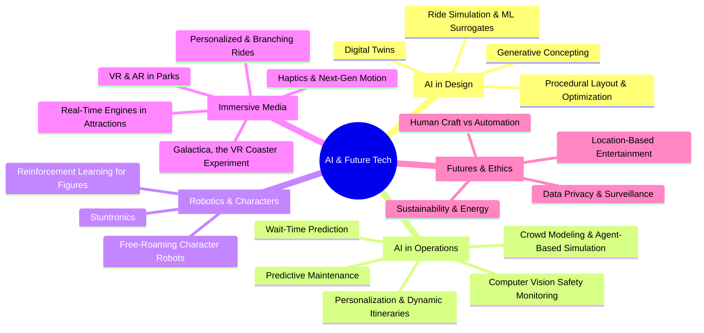

# AI & Future Tech — mindmap

```mermaid
mindmap
  root((AI & Future Tech))
    ai_in_design[AI in Design]
      Generative Concepting
      Procedural Layout & Optimization
      Digital Twins
      Ride Simulation & ML Surrogates
    ai_in_operations[AI in Operations]
      Crowd Modeling & Agent-Based Simulation
      Wait-Time Prediction
      Predictive Maintenance
      Personalization & Dynamic Itineraries
      Computer Vision Safety Monitoring
    robotics_and_characters[Robotics & Characters]
      Free-Roaming Character Robots
      Reinforcement Learning for Figures
      Stuntronics
    immersive_media[Immersive Media]
      VR & AR in Parks
      Real-Time Engines in Attractions
      Personalized & Branching Rides
      Haptics & Next-Gen Motion
      Galactica, the VR Coaster Experiment
    futures_and_ethics[Futures & Ethics]
      Data Privacy & Surveillance
      Human Craft vs Automation
      Sustainability & Energy
      Location-Based Entertainment
```
