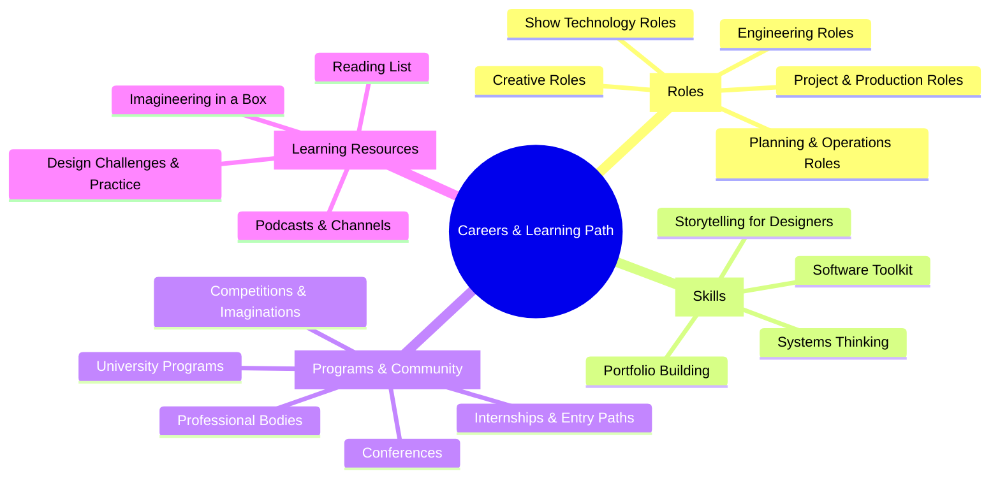

# Careers & Learning Path — mindmap

```mermaid
mindmap
  root((Careers & Learning Path))
    roles[Roles]
      Creative Roles
      Engineering Roles
      Show Technology Roles
      Planning & Operations Roles
      Project & Production Roles
    skills[Skills]
      Portfolio Building
      Software Toolkit
      Storytelling for Designers
      Systems Thinking
    programs_and_community[Programs & Community]
      University Programs
      Competitions & Imaginations
      Conferences
      Professional Bodies
      Internships & Entry Paths
    learning_resources[Learning Resources]
      Imagineering in a Box
      Reading List
      Podcasts & Channels
      Design Challenges & Practice
```
