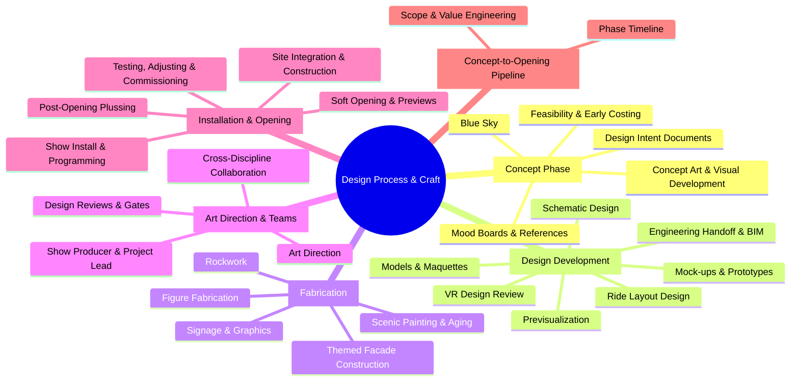

# Design Process & Craft — mindmap

```mermaid
mindmap
  root((Design Process & Craft))
    concept_phase[Concept Phase]
      Blue Sky
      Concept Art & Visual Development
      Design Intent Documents
      Mood Boards & References
      Feasibility & Early Costing
    design_development[Design Development]
      Schematic Design
      Models & Maquettes
      Previsualization
      VR Design Review
      Ride Layout Design
      Engineering Handoff & BIM
      Mock-ups & Prototypes
    fabrication[Fabrication]
      Rockwork
      Scenic Painting & Aging
      Themed Facade Construction
      Figure Fabrication
      Signage & Graphics
    art_direction_and_teams[Art Direction & Teams]
      Art Direction
      Show Producer & Project Lead
      Cross-Discipline Collaboration
      Design Reviews & Gates
    installation_and_opening[Installation & Opening]
      Site Integration & Construction
      Show Install & Programming
      Testing, Adjusting & Commissioning
      Soft Opening & Previews
      Post-Opening Plussing
    pipeline_overview[Concept-to-Opening Pipeline]
      Phase Timeline
      Scope & Value Engineering
```
