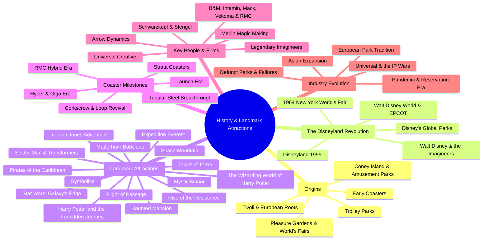

# History & Landmark Attractions — mindmap

```mermaid
mindmap
  root((History & Landmark Attractions))
    origins[Origins]
      Pleasure Gardens & World's Fairs
      Coney Island & Amusement Parks
      Early Coasters
      Trolley Parks
      Tivoli & European Roots
    disneyland_revolution[The Disneyland Revolution]
      Disneyland 1955
      Walt Disney & the Imagineers
      1964 New York World's Fair
      Walt Disney World & EPCOT
      Disney's Global Parks
    landmark_attractions[Landmark Attractions]
      Pirates of the Caribbean
      Haunted Mansion
      Space Mountain
      Matterhorn Bobsleds
      Indiana Jones Adventure
      Tower of Terror
      Spider-Man & Transformers
      Harry Potter and the Forbidden Journey
      Rise of the Resistance
      Flight of Passage
      Expedition Everest
      Mystic Manor
      Symbolica
      The Wizarding World of Harry Potter
      Star Wars: Galaxy's Edge
    coaster_milestones[Coaster Milestones]
      Tubular Steel Breakthrough
      Corkscrew & Loop Revival
      Hyper & Giga Era
      Strata Coasters
      Launch Era
      RMC Hybrid Era
    key_people_and_firms[Key People & Firms]
      Arrow Dynamics
      Schwarzkopf & Stengel
      B&M, Intamin, Mack, Vekoma & RMC
      Legendary Imagineers
      Universal Creative
      Merlin Magic Making
    industry_evolution[Industry Evolution]
      Universal & the IP Wars
      Asian Expansion
      European Park Tradition
      Defunct Parks & Failures
      Pandemic & Reservation Era
```
