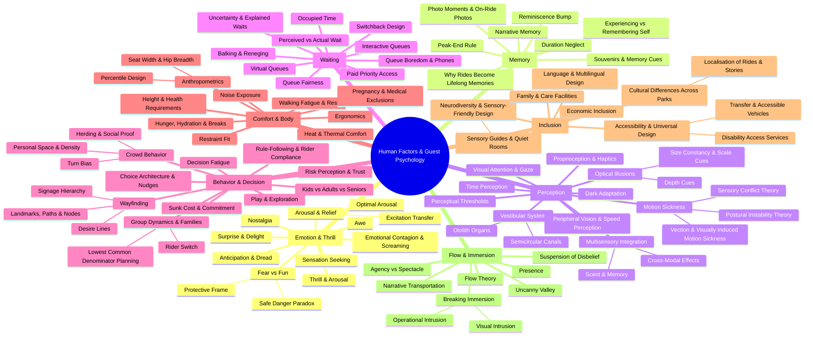

# Human Factors & Guest Psychology — mindmap

```mermaid
mindmap
  root((Human Factors & Guest Psychology))
    emotion_and_thrill[Emotion & Thrill]
      Fear vs Fun
        Safe Danger Paradox
        Protective Frame
      Anticipation & Dread
      Arousal & Relief
        Excitation Transfer
        Optimal Arousal
      Thrill & Arousal
      Awe
      Nostalgia
      Surprise & Delight
      Emotional Contagion & Screaming
      Sensation Seeking
    memory[Memory]
      Peak-End Rule
      Experiencing vs Remembering Self
      Duration Neglect
      Photo Moments & On-Ride Photos
      Reminiscence Bump
      Souvenirs & Memory Cues
      Narrative Memory
      Why Rides Become Lifelong Memories
    perception[Perception]
      Vestibular System
        Semicircular Canals
        Otolith Organs
      Proprioception & Haptics
      Motion Sickness
        Sensory Conflict Theory
        Postural Instability Theory
        Vection & Visually Induced Motion Sickness
      Perceptual Thresholds
      Optical Illusions
        Size Constancy & Scale Cues
        Depth Cues
      Multisensory Integration
        Cross-Modal Effects
        Scent & Memory
      Visual Attention & Gaze
      Peripheral Vision & Speed Perception
      Dark Adaptation
      Time Perception
    waiting[Waiting]
      Perceived vs Actual Wait
      Occupied Time
      Queue Fairness
      Uncertainty & Explained Waits
      Balking & Reneging
      Virtual Queues
      Paid Priority Access
      Queue Boredom & Phones
      Interactive Queues
      Switchback Design
    behavior_and_decision[Behavior & Decision]
      Wayfinding
        Landmarks, Paths & Nodes
        Signage Hierarchy
        Desire Lines
      Crowd Behavior
        Herding & Social Proof
        Turn Bias
        Personal Space & Density
      Decision Fatigue
      Choice Architecture & Nudges
      Sunk Cost & Commitment
      Group Dynamics & Families
        Rider Switch
        Lowest Common Denominator Planning
      Kids vs Adults vs Seniors
      Risk Perception & Trust
      Rule-Following & Rider Compliance
      Play & Exploration
    comfort_and_body[Comfort & Body]
      Ergonomics
      Anthropometrics
        Percentile Design
        Seat Width & Hip Breadth
      Restraint Fit
      Height & Health Requirements
      Heat & Thermal Comfort
      Walking Fatigue & Rest
      Hunger, Hydration & Breaks
      Pregnancy & Medical Exclusions
      Noise Exposure
    inclusion[Inclusion]
      Accessibility & Universal Design
        Transfer & Accessible Vehicles
        Disability Access Services
      Neurodiversity & Sensory-Friendly Design
        Sensory Guides & Quiet Rooms
      Cultural Differences Across Parks
        Localisation of Rides & Stories
      Language & Multilingual Design
      Economic Inclusion
      Family & Care Facilities
    flow_and_immersion[Flow & Immersion]
      Presence
      Suspension of Disbelief
      Breaking Immersion
        Visual Intrusion
        Operational Intrusion
      Flow Theory
      Narrative Transportation
      Uncanny Valley
      Agency vs Spectacle
```
