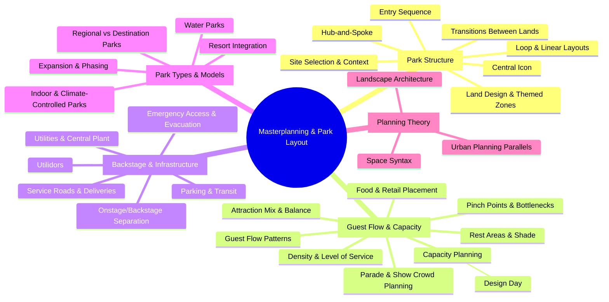

# Masterplanning & Park Layout — mindmap

```mermaid
mindmap
  root((Masterplanning & Park Layout))
    park_structure[Park Structure]
      Hub-and-Spoke
      Loop & Linear Layouts
      Land Design & Themed Zones
      Entry Sequence
      Central Icon
      Transitions Between Lands
      Site Selection & Context
    guest_flow_and_capacity[Guest Flow & Capacity]
      Capacity Planning
        Design Day
      Attraction Mix & Balance
      Guest Flow Patterns
      Pinch Points & Bottlenecks
      Density & Level of Service
      Rest Areas & Shade
      Food & Retail Placement
      Parade & Show Crowd Planning
    backstage_and_infrastructure[Backstage & Infrastructure]
      Onstage/Backstage Separation
      Utilidors
      Service Roads & Deliveries
      Utilities & Central Plant
      Parking & Transit
      Emergency Access & Evacuation
    park_types[Park Types & Models]
      Regional vs Destination Parks
      Resort Integration
      Indoor & Climate-Controlled Parks
      Water Parks
      Expansion & Phasing
    planning_theory[Planning Theory]
      Urban Planning Parallels
      Landscape Architecture
      Space Syntax
```
