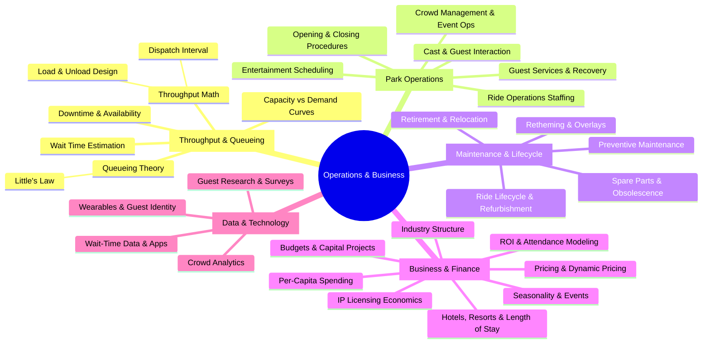

# Operations & Business — mindmap

```mermaid
mindmap
  root((Operations & Business))
    throughput_and_queueing[Throughput & Queueing]
      Throughput Math
        Dispatch Interval
        Load & Unload Design
      Queueing Theory
        Little's Law
      Wait Time Estimation
      Downtime & Availability
      Capacity vs Demand Curves
    park_operations[Park Operations]
      Ride Operations Staffing
      Cast & Guest Interaction
      Crowd Management & Event Ops
      Entertainment Scheduling
      Guest Services & Recovery
      Opening & Closing Procedures
    maintenance_and_lifecycle[Maintenance & Lifecycle]
      Preventive Maintenance
      Ride Lifecycle & Refurbishment
      Retheming & Overlays
      Retirement & Relocation
      Spare Parts & Obsolescence
    business_and_finance[Business & Finance]
      Budgets & Capital Projects
      ROI & Attendance Modeling
      Pricing & Dynamic Pricing
      Per-Capita Spending
      Seasonality & Events
      Hotels, Resorts & Length of Stay
      IP Licensing Economics
      Industry Structure
    data_and_technology[Data & Technology]
      Wait-Time Data & Apps
      Wearables & Guest Identity
      Crowd Analytics
      Guest Research & Surveys
```
