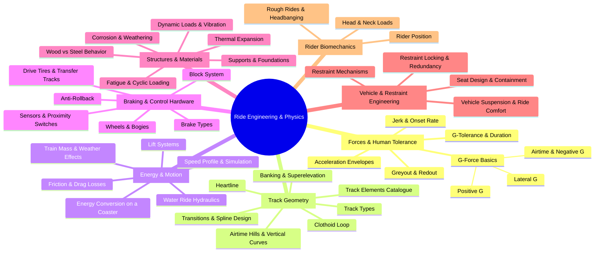

# Ride Engineering & Physics — mindmap

```mermaid
mindmap
  root((Ride Engineering & Physics))
    forces_and_tolerance[Forces & Human Tolerance]
      G-Force Basics
        Positive G
        Airtime & Negative G
        Lateral G
      G-Tolerance & Duration
      Jerk & Onset Rate
      Greyout & Redout
      Acceleration Envelopes
    track_geometry[Track Geometry]
      Clothoid Loop
      Heartline
      Banking & Superelevation
      Track Elements Catalogue
      Transitions & Spline Design
      Airtime Hills & Vertical Curves
      Track Types
    energy_and_motion[Energy & Motion]
      Energy Conversion on a Coaster
      Friction & Drag Losses
      Train Mass & Weather Effects
      Lift Systems
      Speed Profile & Simulation
      Water Ride Hydraulics
    braking_and_control_hardware[Braking & Control Hardware]
      Block System
      Brake Types
      Anti-Rollback
      Sensors & Proximity Switches
      Wheels & Bogies
      Drive Tires & Transfer Tracks
    structures_and_materials[Structures & Materials]
      Supports & Foundations
      Fatigue & Cyclic Loading
      Dynamic Loads & Vibration
      Wood vs Steel Behavior
      Corrosion & Weathering
      Thermal Expansion
    vehicle_and_restraint_engineering[Vehicle & Restraint Engineering]
      Restraint Mechanisms
      Restraint Locking & Redundancy
      Seat Design & Containment
      Vehicle Suspension & Ride Comfort
    rider_biomechanics[Rider Biomechanics]
      Head & Neck Loads
      Rider Position
      Rough Rides & Headbanging
```
