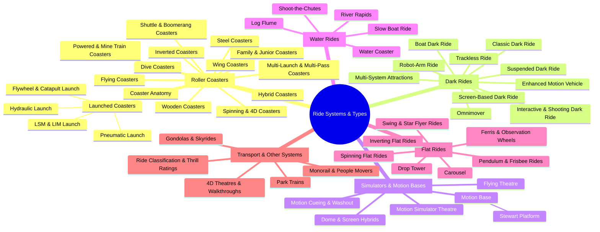

# Ride Systems & Types — mindmap

```mermaid
mindmap
  root((Ride Systems & Types))
    roller_coasters[Roller Coasters]
      Coaster Anatomy
      Wooden Coasters
      Steel Coasters
      Hybrid Coasters
      Launched Coasters
        LSM & LIM Launch
        Hydraulic Launch
        Pneumatic Launch
        Flywheel & Catapult Launch
      Inverted Coasters
      Wing Coasters
      Flying Coasters
      Dive Coasters
      Spinning & 4D Coasters
      Family & Junior Coasters
      Shuttle & Boomerang Coasters
      Multi-Launch & Multi-Pass Coasters
      Powered & Mine Train Coasters
    dark_rides[Dark Rides]
      Classic Dark Ride
      Omnimover
      Trackless Ride
      Enhanced Motion Vehicle
      Robot-Arm Ride
      Interactive & Shooting Dark Ride
      Boat Dark Ride
      Suspended Dark Ride
      Screen-Based Dark Ride
      Multi-System Attractions
    simulators_and_motion_bases[Simulators & Motion Bases]
      Motion Base
        Stewart Platform
      Flying Theatre
      Motion Simulator Theatre
      Dome & Screen Hybrids
      Motion Cueing & Washout
    water_rides[Water Rides]
      Log Flume
      River Rapids
      Shoot-the-Chutes
      Water Coaster
      Slow Boat Ride
    flat_rides[Flat Rides]
      Carousel
      Ferris & Observation Wheels
      Drop Tower
      Pendulum & Frisbee Rides
      Swing & Star Flyer Rides
      Inverting Flat Rides
      Spinning Flat Rides
    transport_and_other[Transport & Other Systems]
      Monorail & People Movers
      Park Trains
      Gondolas & Skyrides
      4D Theatres & Walkthroughs
      Ride Classification & Thrill Ratings
```
