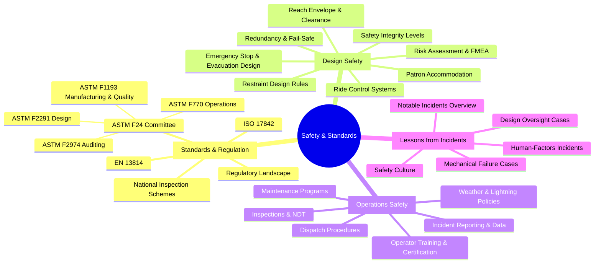

# Safety & Standards — mindmap

```mermaid
mindmap
  root((Safety & Standards))
    standards_and_regulation[Standards & Regulation]
      ASTM F24 Committee
        ASTM F2291 Design
        ASTM F770 Operations
        ASTM F1193 Manufacturing & Quality
        ASTM F2974 Auditing
      EN 13814
      ISO 17842
      Regulatory Landscape
      National Inspection Schemes
    design_safety[Design Safety]
      Risk Assessment & FMEA
      Ride Control Systems
      Redundancy & Fail-Safe
      Safety Integrity Levels
      Reach Envelope & Clearance
      Emergency Stop & Evacuation Design
      Restraint Design Rules
      Patron Accommodation
    operations_safety[Operations Safety]
      Inspections & NDT
      Maintenance Programs
      Operator Training & Certification
      Dispatch Procedures
      Weather & Lightning Policies
      Incident Reporting & Data
    lessons_from_incidents[Lessons from Incidents]
      Notable Incidents Overview
      Human-Factors Incidents
      Mechanical Failure Cases
      Design Oversight Cases
      Safety Culture
```
