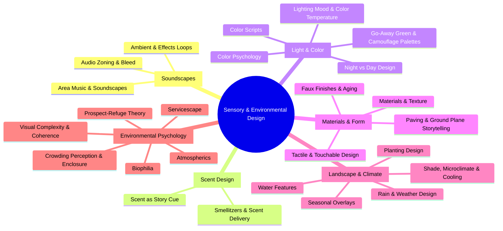

# Sensory & Environmental Design — mindmap

```mermaid
mindmap
  root((Sensory & Environmental Design))
    sound_design[Soundscapes]
      Area Music & Soundscapes
      Audio Zoning & Bleed
      Ambient & Effects Loops
    scent_design[Scent Design]
      Smellitzers & Scent Delivery
      Scent as Story Cue
    light_and_color[Light & Color]
      Lighting Mood & Color Temperature
      Color Psychology
      Color Scripts
      Night vs Day Design
      Go-Away Green & Camouflage Palettes
    materials_and_form[Materials & Form]
      Materials & Texture
      Faux Finishes & Aging
      Paving & Ground Plane Storytelling
      Tactile & Touchable Design
    landscape_and_climate[Landscape & Climate]
      Planting Design
      Water Features
      Shade, Microclimate & Cooling
      Rain & Weather Design
      Seasonal Overlays
    environmental_psychology[Environmental Psychology]
      Prospect-Refuge Theory
      Biophilia
      Servicescape
      Atmospherics
      Crowding Perception & Enclosure
      Visual Complexity & Coherence
```
