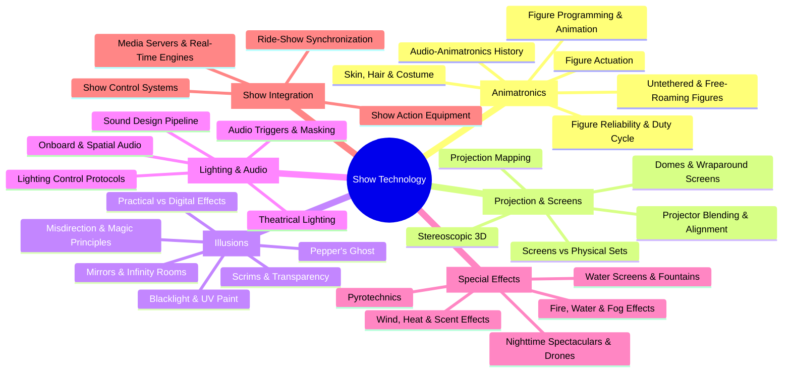

# Show Technology — mindmap

```mermaid
mindmap
  root((Show Technology))
    animatronics[Animatronics]
      Audio-Animatronics History
      Figure Actuation
      Figure Programming & Animation
      Skin, Hair & Costume
      Untethered & Free-Roaming Figures
      Figure Reliability & Duty Cycle
    projection_and_screens[Projection & Screens]
      Projection Mapping
      Domes & Wraparound Screens
      Stereoscopic 3D
      Screens vs Physical Sets
      Projector Blending & Alignment
    illusions[Illusions]
      Pepper's Ghost
      Scrims & Transparency
      Mirrors & Infinity Rooms
      Practical vs Digital Effects
      Blacklight & UV Paint
      Misdirection & Magic Principles
    lighting_and_audio[Lighting & Audio]
      Theatrical Lighting
      Lighting Control Protocols
      Onboard & Spatial Audio
      Audio Triggers & Masking
      Sound Design Pipeline
    special_effects[Special Effects]
      Fire, Water & Fog Effects
      Pyrotechnics
      Wind, Heat & Scent Effects
      Water Screens & Fountains
      Nighttime Spectaculars & Drones
    show_integration[Show Integration]
      Show Control Systems
      Ride-Show Synchronization
      Show Action Equipment
      Media Servers & Real-Time Engines
```
