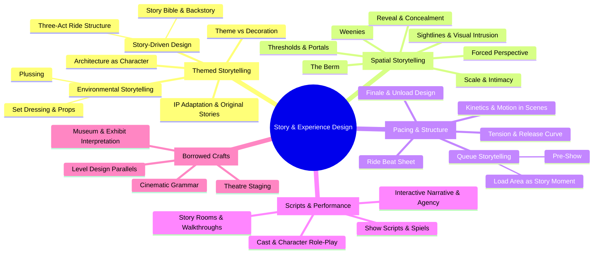

# Story & Experience Design — mindmap

```mermaid
mindmap
  root((Story & Experience Design))
    themed_storytelling[Themed Storytelling]
      Story-Driven Design
        Story Bible & Backstory
        Three-Act Ride Structure
      Environmental Storytelling
        Set Dressing & Props
        Plussing
      IP Adaptation & Original Stories
      Theme vs Decoration
      Architecture as Character
    spatial_storytelling[Spatial Storytelling]
      Weenies
      Forced Perspective
      Sightlines & Visual Intrusion
      The Berm
      Thresholds & Portals
      Reveal & Concealment
      Scale & Intimacy
    pacing_and_structure[Pacing & Structure]
      Queue Storytelling
        Pre-Show
        Load Area as Story Moment
      Ride Beat Sheet
      Tension & Release Curve
      Finale & Unload Design
      Kinetics & Motion in Scenes
    scripts_and_performance[Scripts & Performance]
      Show Scripts & Spiels
      Cast & Character Role-Play
      Interactive Narrative & Agency
      Story Rooms & Walkthroughs
    borrowed_crafts[Borrowed Crafts]
      Cinematic Grammar
      Level Design Parallels
      Theatre Staging
      Museum & Exhibit Interpretation
```
